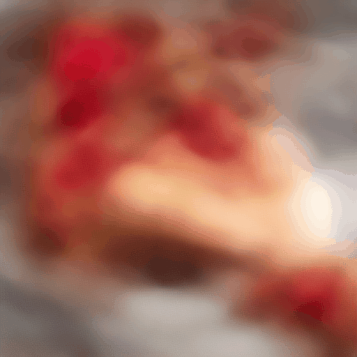
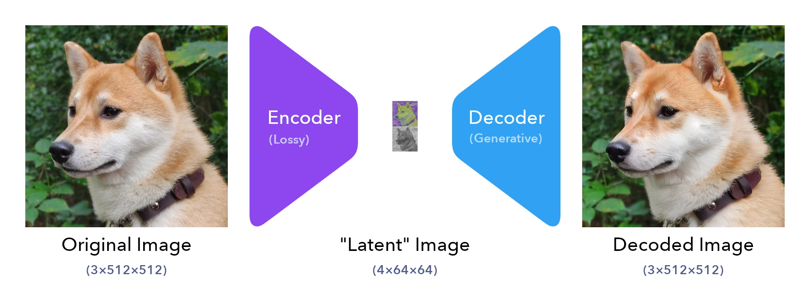
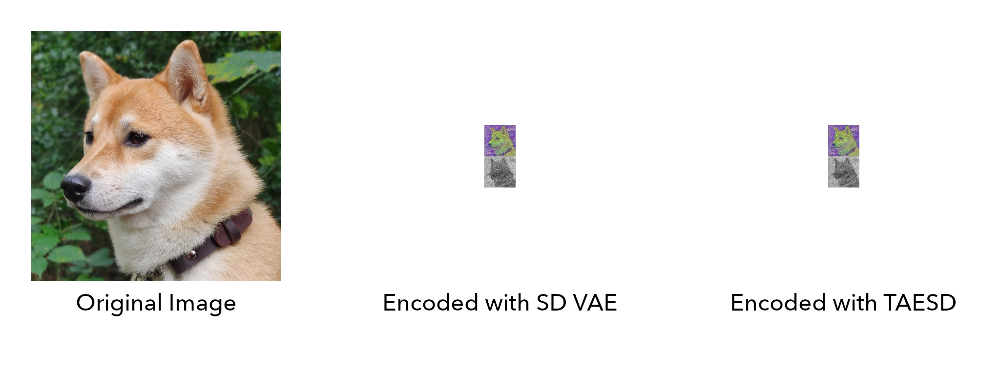
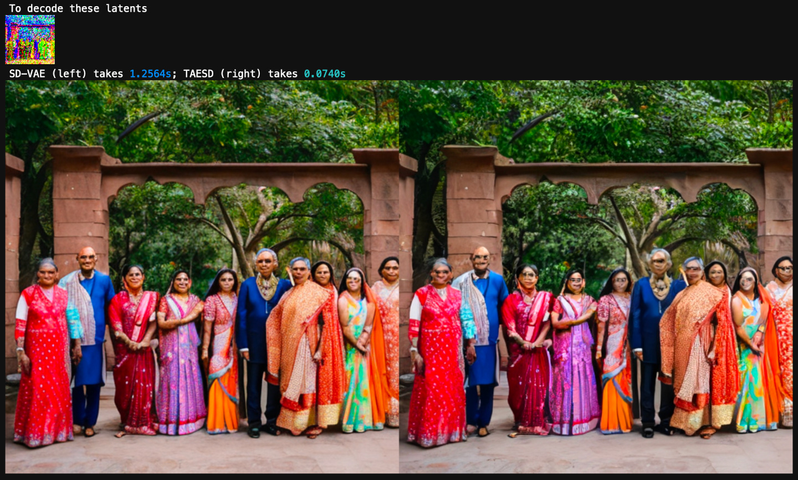

# 🍰 Tiny AutoEncoder for Stable Diffusion

## What is TAESD?

TAESD is very tiny autoencoder which uses the same "latent API" as Stable Diffusion's VAE*. TAESD can decode Stable Diffusion's latents into full-size images at (nearly) zero cost. Here's a comparison on my laptop:

TAESD is compatible with SD1/2-based models (using the `taesd_*` weights).

TAESD is also compatible with SDXL-based models (using the `taesdxl_*` weights), SD3-based models (using the `taesd3_*` weights), and FLUX.1-based models (using the `taef1_*` weights).

## Where can I get TAESD?

* TAESD is already available in
    * [A1111](https://github.com/AUTOMATIC1111/stable-diffusion-webui)
       * As a previewer, thanks to [Sakura-Luna](https://github.com/AUTOMATIC1111/stable-diffusion-webui/pull/10365) (enable it in [Settings > Live Previews](https://github.com/madebyollin/taesd/issues/7#issuecomment-1669809631))
       * As a encoder / decoder, thanks to [Kohaku-Blueleaf](https://github.com/AUTOMATIC1111/stable-diffusion-webui/pull/12311) (try it in [Settings > VAE](https://github.com/AUTOMATIC1111/stable-diffusion-webui/blob/dev/modules/shared_options.py#L152-L165))
    * [vladmandic](https://github.com/vladmandic/automatic) thanks to [vladmandic](https://github.com/vladmandic/automatic/discussions/99#discussioncomment-6041142)
    * [ComfyUI](https://github.com/comfyanonymous/ComfyUI)
        * As a previewer, thanks to [space-nuko](https://github.com/comfyanonymous/ComfyUI/pull/713) (follow the instructions under ["How to show high-quality previews"](https://github.com/comfyanonymous/ComfyUI#how-to-show-high-quality-previews), then launch ComfyUI with `--preview-method taesd`)
        * As a standalone VAE (download **both** `taesd_encoder.pth` and `taesd_decoder.pth` into `models/vae_approx`, then add a `Load VAE` node and set `vae_name` to `taesd`)
* TAESD is also available for [🧨 Diffusers](https://huggingface.co/docs/diffusers/main/en/api/models/autoencoder_tiny) in `safetensors` format
   * [taesd](https://huggingface.co/madebyollin/taesd)
   * [taesdxl](https://huggingface.co/madebyollin/taesdxl)
   * [taesd3](https://huggingface.co/madebyollin/taesd3)
   * [taef1](https://huggingface.co/madebyollin/taef1)
* TAESD's original weights are in this repo

## What can I use TAESD for?

Since TAESD is very fast, you can use TAESD to watch Stable Diffusion's image generation progress in real time. Here's a minimal [example notebook](examples/Previewing_During_Image_Generation.ipynb) that adds TAESD previewing to the 🧨 Diffusers implementation of SD2.1.

Since TAESD includes an encoder, you can use TAESD for any tasks where the official VAE is [inconvenient](https://twitter.com/cloneofsimo/status/1624134163136933893). Note that TAESD uses different scaling conventions than the official VAE (TAESD expects image values to be in [0, 1] instead of [-1, 1], and TAESD's "scale_factor" for latents is 1 instead of some [long](https://github.com/CompVis/stable-diffusion/blob/main/configs/stable-diffusion/v1-inference.yaml#L17) [decimal](https://github.com/Stability-AI/generative-models/blob/main/configs/inference/sd_xl_base.yaml#L4)). Here's an [example notebook](examples/Encoding_and_Decoding.ipynb) showing how to use TAESD for encoding / decoding.

## How does TAESD work?

TAESD is a tiny, distilled version of Stable Diffusion's VAE*, which consists of an encoder and decoder. The encoder turns full-size images into small "latent" ones (with 48x lossy compression), and the decoder then generates new full-size images based on the encoded latents by making up new details.

The original / decoded images are of shape `3xHxW` with values in approximately `[0, 1]`, and the latents are of shape `4x(H/8)x(W/8)` with values in approximately `[-3, 3]`. You can clip and quantize TAESD latents into 8-bit PNGs without much loss of quality. TAESD latents should look pretty much like Stable Diffusion latents.

Internally, TAESD is a bunch of Conv+ReLU resblocks and 2x upsample layers:

## What are the limitations of TAESD?

If you want to decode detailed, high-quality images, and don't care how long it takes, you should just use the original SD VAE* decoder (or possibly OpenAI's [Consistency Decoder](https://github.com/openai/consistencydecoder)). TAESD is very tiny and trying to work very quickly, so it tends to fudge fine details. Example:

TAESD trades a (modest) loss in quality for a (substantial) gain in speed and convenience.

## Comparison table

|                                                              | SD VAE*                                                      | TAESD                                                        |
| ------------------------------------------------------------ | ------------------------------------------------------------ | ------------------------------------------------------------ |
| Parameters in Encoder                                        | 34,163,592                                                   | 1,222,532                                                    |
| Parameters in Decoder                                        | 49,490,179                                                   | 1,222,531                                                    |
| ONNX Ops                                                     | Add, Cast, Concat, Constant, ConstantOfShape, Conv, Div, Gather, InstanceNormalization, MatMul, Mul, Pad, Reshape, Resize, Shape, Sigmoid, Slice, Softmax, Transpose, Unsqueeze | Add, Constant, Conv, Div, Mul, Relu, Resize, Tanh            |
| Runtime / memory scales linearly with size of the latents    | No                                                           | Yes                                                          |
| Bounded receptive field so you can split decoding work into tiles without, like, weird seams and stuff | No                                                           | ~~Yes~~ (**EDIT**: but you still need enough tile overlap to cover TAESD's bounded receptive field... so [in practice](https://github.com/madebyollin/taesd/issues/8#issuecomment-1675992525), I still wouldn't recommend tiled decoding :P) |
| High-quality details                                         | Yes                                                          | No                                                           |
| Tiny                                                         | No                                                           | Yes                                                          |

---

\* VQGAN? AutoencoderKL? `first_stage_model`? [This thing.](https://github.com/huggingface/diffusers/blob/v0.29.0/src/diffusers/models/autoencoders/autoencoder_kl.py#L35) See also [this gist](https://gist.github.com/madebyollin/ff6aeadf27b2edbc51d05d5f97a595d9) which has additional links and information about the VAEs.
